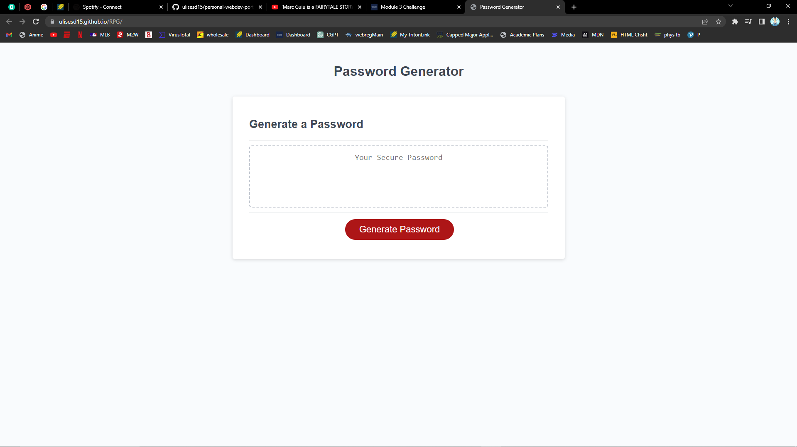

# RPG (Random Password Generator)
## User Story
As a bootcamp student, I want to correctly build a random password generator with its appropiate functions and limitations. So that I could be ready to compete in the professional setting.
## Acceptance Criteria
GIVEN a new and secured password is needed, THEN a new password will be created with the options of having uppercase letters, lowercase letters, special characters, and numeric variables. GIVEN that the user doesn't choose any of the options for the password, THEN webpage will demand at least one of the options to be selected. GIVEN user chooses a non-numeric value or a value outside of 8-128 for character length, THEN webpage will demand the character length between 28-128.
## Webpage URL
https://ulisesd15.github.io/RPG/

### Webpage Screenshot

## How to access file
javascript file:    RPG/assets/script.js
css file:           RPG/assets/style.css
index file:         RPG/index.html

## Resources
I was really struggling at first with the formatting of the webpage until I watched the video https://www.youtube.com/watch?v=x4HUaiazDes by Paul Keldsen- Web Development
I also received help from a classmate named Emily Morosoff and her tutor "Jaba" because I was lost as to what commands to use in certain steps but their help guided me in this assignment.
